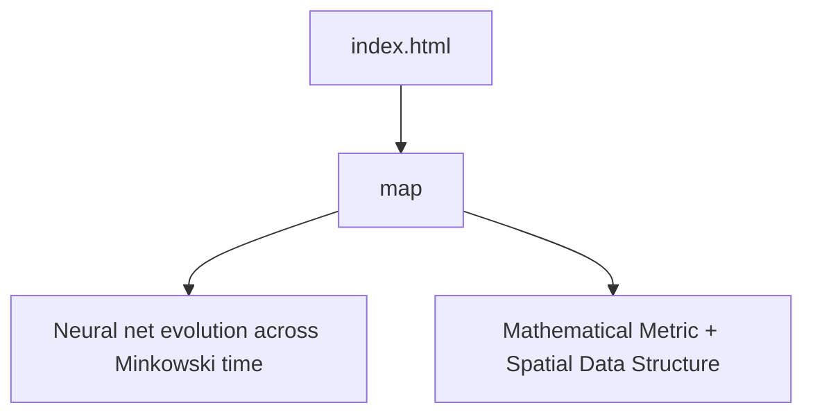

### Web container for project 9ly (map.html)

Currently using Kepler equations to model orbits without any links to neural net component (ark-neural-net). 

No papers written yet. I'm a first-year student. Give me some time.

#### The ambition is to integrate QFT and QCD while developing my own theory on what brand of orbital mechanics to reference in the generation of this simulation.

# 9ly version 17/08/26 19:20

## Understanding
Transform map.html from a 2D orbital plane simulat with procedural starfield into an accurate 3D heliocentric system using real ephemeris data from SIMBAD. Remove Rigel, build out the Solar System (Mercury, Venus, Mars, Jupiter, Saturn, Uranus, Neptune) and nearby stars (9 light-years list) with true 3D positions, scales, and orbital/axial tilts. Eliminate Math.random() and replace with deterministic ephemeris data.

## Assumptions
- SIMBAD ephemeris data will be hardcoded into map.html (fetching via API adds latency; initial implementation uses static data)
- Solar System orbital elements from Standish 2006 or JPL Horizons (user will provide or we use standard references)
- Nearby stars' 3D positions derived from distance, proper motion (RA/Dec), and radial velocity (already partially in code)
- Wireframe icosahedrons scaled linearly to true body radii (no log scaling for body sizes, only for distance guides)
- Log10 distance scaling for spatial layout remains (essential for viewing 9 ly + 8 AU range)
- Neural network in vector.py is forward-pass only; we're preparing data pipeline for reward function (accuracy metric: positional error over time)

## Approach
1. **Remove Rigel and fake starfield** – Delete starfield() and Rigel references. Keep reference rings (distance guides).
2. **Add Solar System bodies** – Mercury, Venus, Mars, Jupiter, Saturn, Uranus, Neptune with canonical orbital elements (semimajor axis, eccentricity, inclination, node, perihelion, mean anomaly at epoch).
3. **Add nearby stars (9 ly)** – Proxima Centauri, Alpha Centauri A & B, Barnard's Star, Wolf 359, Lalande 21185, Sirius A & B, Luyten 726-8. Use SIMBAD parallax + proper motion + RV to compute 3D cartesian position and velocity.
4. **3D positioning** – Sun at origin. Ecliptic plane is reference (XZ), but allow bodies to have 3D positions (Y ≠ 0). Inclinations and node longitudes tilt orbits out of the ecliptic.
5. **Accurate orbital tilts** –Each planet has true orbital inclination and ascending node. Axial tilts (day-night cycle) remain.
6. **Ephemeris data dictionary** – Hardcode canonical elements and star data as JS objects; no fetching at runtime.
7. **HUD update** – Remove Rigel references, add Mars, Jupiter, etc. Show distances/velocities for active bodies.
8. **Reset button** – Keep; re-initializes all orbital state to epoch (J2000 or user-chosen date).

## Key Files
- [map.html](map.html) – Three.js scene, simulation loop, ephemeris computations. Main work here.
- [vector.py](vector.py) – Already has basic Vector/Matrix/Neuron. Will add ephemeris state pipeline later (not in this step).
- [index.html](index.html) – Landing page; we ensure map.html link works and document the nav.

## Risks & Open Questions
- **SIMBAD data accuracy**: User will need to verify we're using correct parallax/motion; initial implementation uses published values (Gaia DR3, Hipparcos). If user provides better data, we swap.
- **Epoch ambiguity**: Should we use J2000 (2000-01-01) or current date? Recommend J2000 for reproducibility, but allow easy date-shifting.
- **Rendering scale limits**: 9 ly ≈ 600,000 AU. Log10(600000) ≈ 6.78 → ~439 units. Planets are ~0.1 AU → ~5.5 units. Small but renderable. May need camera zoom tweaks.
- **Orbital precession for planets**: Kepler elements do precess (apsidal/nodal). For now, use static elements over ~few years. Long-term, add time-dependent precession terms.
- **Neural net integration**: vector.py is standalone. Reward function (positional MSE vs real ephemeris) will be added later; for now, we just ensure data is exported in correct format.

**Last Updated**: 2026-08-17 08:59:09

## 📝 Plan Steps
-  **Remove Rigel references and procedural starfield from map.html**
-  **Build ephemeris data dictionary for Solar System (Mercury–Neptune) with canonical orbital elements**
-  **Build ephemeris data dictionary for nearby stars (9 ly list) with 3D position/velocity derived from parallax, PM, RV**
-  **Modify makeBody() and scene setup to include all 8 planets + Sun + all nearby stars**
-  **Update Kepler solver and orbital initialization to handle non-ecliptic (3D) orbits via inclination and ascending node**
-  **Rebuild simulation loop to compute 3D positions for all bodies using proper Kepler mechanics**
-  **Update HUD and labels to display relevant bodies; remove Rigel, add Mars/Jupiter/etc.**
-  **Update focus buttons to include key planets and stars (Sol, Earth, Mars, Jupiter, Proxima, etc.)**
-  **Remove starfield; verify reference rings are visible and useful at multiple scales**
-  **Test reset button and animation loop; verify no 2D-plane artifacts and all bodies have independent 3D positions**
-  **Document data sources (Standish 2006, SIMBAD, Gaia) in HTML comments and HUD subtitle**
-  **Validate against known ephemeris (e.g., Earth should match NASA/JPL Horizons for a given date)**

