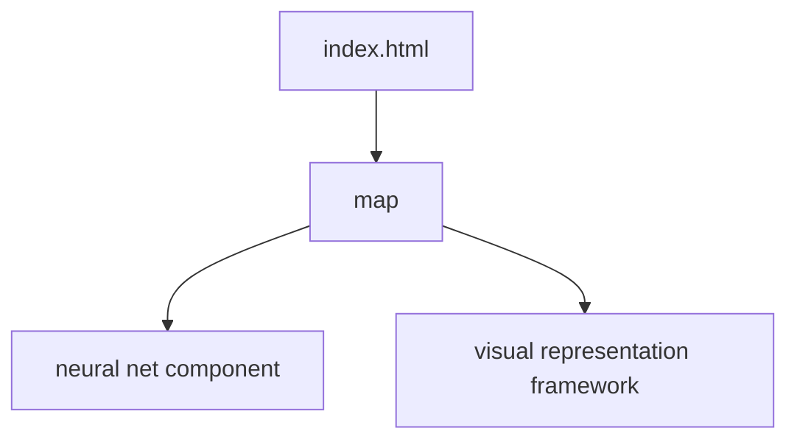

### Web container for universe simulation

Currently using Kepler equations to model orbits without any links to neural net component (ark-neural-net). 

No papers written yet. I'm a first-year student. Give me some time.

